# 🌍 Geo-AI Feature Extraction: Deep Learning Pipelines

This repository houses a collection of high-performance **Research & Development notebooks** designed to extract critical geospatial features from high-resolution drone orthophotos.

Using state-of-the-art Computer Vision techniques, we process massive geospatial datasets (GeoTIFFs) to identify and segment infrastructure and natural features.

## 🧠 Core Research Notebooks

The primary value of this project lies in the specialized Jupyter notebooks, each tailored for a specific feature extraction challenge. 

| Notebook | Feature Type | Description |
|----------|-------------|-------------|
| 🏢 **`building.ipynb`** | **Building Footprints** | End-to-end pipeline for segmenting building rooftops. Features strict mask alignment and U-Net training with ResNet encoders. |
| 🛣️ **`main.ipynb`** | **Road Network** | Rasterizes linear road vectors into masks and trains a model to detect road surfaces/centerlines, handling complex connectivity. |
| 💧 **`waterbodies.ipynb`** | **Water Bodies** | Semantic segmentation for ponds, potential lakes, and water storage. Optimized to reduce false positives in dry terrain. |
| 🚂 **`railways.ipynb`** | **Railway Tracks** | Specialized pipeline for linear feature extraction, preserving the connectivity of railway segments over long distances. |
| ⚡ **`utilities.ipynb`** | **Utilities** | Detection of smaller utility infrastructure. Handles high-imbalance classes where features are small relative to the image size. |

## 🔬 Scientific Methodology

Our approach follows a rigorous deep learning pipeline adapted for geospatial data.

### Training Pipeline

The training process involves strict alignment of vector ground truth with raster imagery.

```mermaid
graph TD
    A[📡 Raw Orthophoto .tif] --> C(🧱 Tiling 512x512)
    B[🗺️ Vector Shapefiles .shp] --> D(🎭 Rasterization)
    B --> B1(📍 CRS Reprojection)
    B1 --> D
    C --> E{🔄 Data Alignment}
    D --> E
    E --> F[🖼️ Training Batches]
    F --> G[🧠 U-Net Training]
    G --> H[💾 Saved Model Weights .pth]
    
    style A fill:#f9f,stroke:#333,stroke-width:2px
    style B fill:#bbf,stroke:#333,stroke-width:2px
    style G fill:#bfb,stroke:#333,stroke-width:2px
```



### Inference Workflow

For inference on large unseen images, we use a sliding window approach with memory-efficient processing.

```mermaid
graph LR
    Input[New Orthophoto] --> Tile(Tiling & Windowing)
    Tile --> Infer[🚀 GPU Inference]
    Infer --> Prob[Probability Heatmap]
    Prob --> Stitch(🧩 Stitching & Smoothing)
    Stitch --> Thresh{Thresholding}
    Thresh --> Mask[Final Binary Mask]
    Mask --> Vector[📐 Feature Vectors]
    
    style Input fill:#f9f,stroke:#333,stroke-width:2px
    style Infer fill:#f96,stroke:#333,stroke-width:2px
    style Mask fill:#bfb,stroke:#333,stroke-width:2px
```



## 🛠️ Technical Details

### 1. Large-Scale Data Handling
- **Tiling**: Images are too large for GPU memory (1GB+). We slice them into fixed-size chips (e.g., 512x512) with overlap to prevent edge artifacts.
- **Geospatial Alignment**: All vector data (Shapefiles) are strictly reprojected to match the Orthophoto's Coordinate Reference System (CRS) before rasterization.

### 2. Deep Learning Architecture
- **Models**: We primarily use **U-Net** architectures with **ResNet-34** or **ResNet-50** encoders pretrained on ImageNet.
- **Loss Functions**: Custom implementations of **Dice Loss + Binary Cross Entropy (BCE)** to handle class imbalance (e.g., roads are only ~5% of the pixels).

## 🚀 Getting Started

### Prerequisites
- Python 3.9+
- NVIDIA GPU (Recommended)
- 16GB+ RAM

### Setup

1. **Install Dependencies**
   ```bash
   pip install -r app/requirements.txt
   ```

2. **Launch Jupyter**
   ```bash
   jupyter lab
   ```

3. **Data Structure**
   ```
   natgeo/
   ├── data/
   │   ├── images/          # Place huge .tif orthophotos here
   │   └── shp/             # Corresponding .shp shapefiles
   ```

## 📱 Streamlit Visualization (Demo)
To run the visualization demo:
```bash
streamlit run app/app.py
```

## 🤝 Contributing
This is an active research project. If you improve a pipeline (e.g., better loss function for thin features like railways), please submit a Pull Request.
